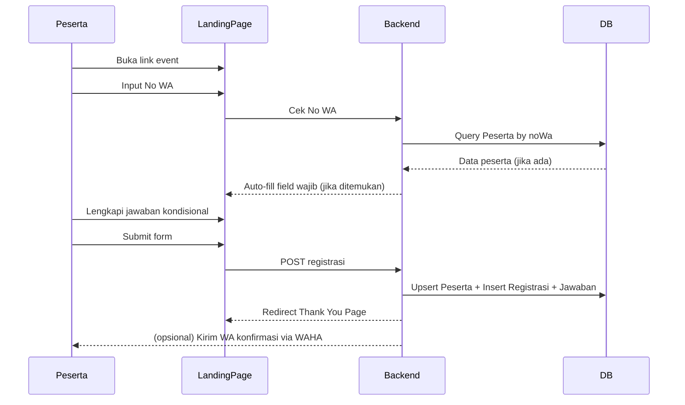
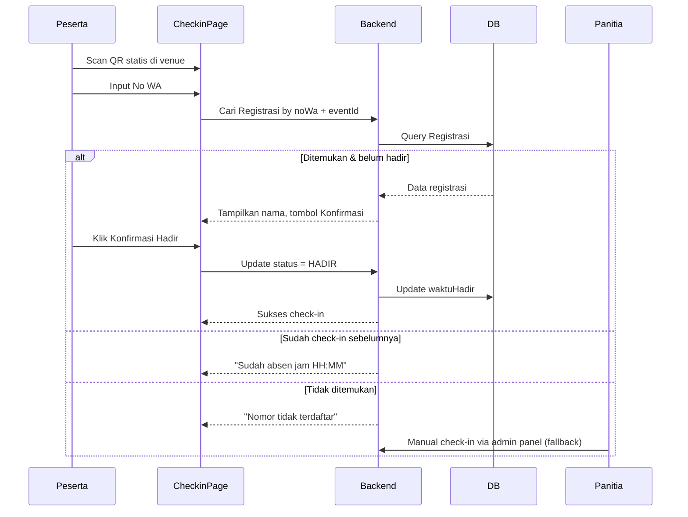
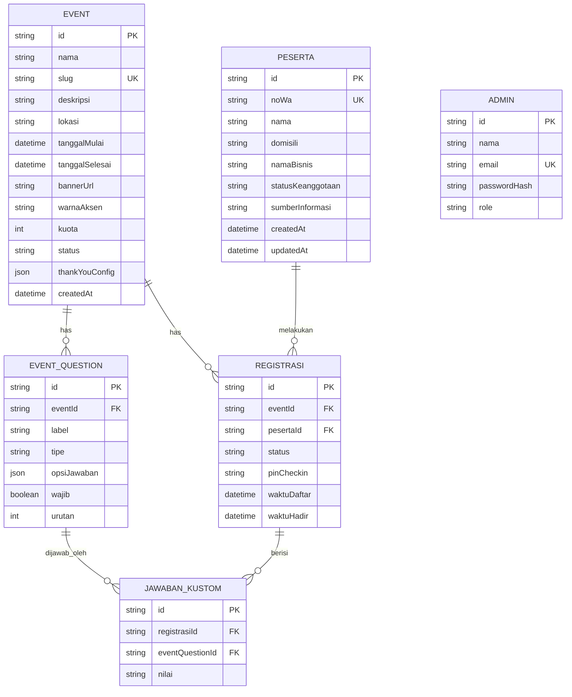

# PRD — Sistem Registrasi & Absensi Event (Bagian Pendidikan)

> **Catatan:** Nama app di dokumen ini sementara "Event Pendidikan". Ganti sesuai preferensi sebelum masuk development.

## 1. Overview

Bagian Pendidikan rutin mengadakan event dan selama ini butuh effort manual untuk membuat landing page registrasi, mengumpulkan data peserta, dan mencatat kehadiran. Aplikasi ini memungkinkan Tim Pendidikan membuat event baru lewat admin panel — landing page registrasi ter-generate otomatis lengkap dengan form (pertanyaan wajib + pertanyaan kondisional custom per event) — tanpa perlu request ke developer tiap kali ada event baru. Peserta yang pernah daftar sebelumnya (dikenali dari No WA) akan auto-fill data wajibnya. Saat hari-H, peserta check-in sendiri lewat scan QR di venue, disupervisi panitia.

**App ini standalone, database terpisah** — tidak terintegrasi dengan sistem Muda Juara Finance yang sudah ada.

---

## 2. Requirements

- **Aksesibilitas:** Web — Admin panel (Tim Pendidikan), Landing page publik per event, Halaman check-in publik. Semua mobile-responsive (check-in dibuka dari HP peserta).
- **Pengguna:**
  - **Admin (Tim Pendidikan):** login, CRUD event, custom question, thank you page, lihat laporan, manual override check-in.
  - **Peserta (publik):** tanpa login, isi form via No WA sebagai identitas.
- **Auth:** iron-session, hanya untuk Admin panel. Halaman publik (form daftar, check-in) tidak pakai login.
- **Data Input:** Manual via web form.
- **Export:** Excel (daftar peserta per event + status kehadiran).
- **Constraint khusus:** Standalone, tidak connect ke Muda Juara Finance. 6 pertanyaan wajib default tidak boleh dihapus/diubah strukturnya oleh admin.

---

## 3. Core Features

### 3.1 Manajemen Event (Admin) — Must-have
- Create/edit/duplicate event: nama, tanggal, lokasi, deskripsi, banner, warna aksen, kuota (opsional, default unlimited)
- Slug otomatis (bisa di-custom) → URL publik `/event/[slug]`
- Status: `DRAFT` / `PUBLISHED` / `CLOSED` / `SELESAI`

### 3.2 Form Builder — Pertanyaan Kondisional — Must-have
- 6 pertanyaan wajib default (fixed, selalu ada di semua event):
  1. No WhatsApp
  2. Nama
  3. Domisili
  4. Nama Bisnis
  5. Status Keanggotaan (Umum / Muda Juara)
  6. Sumber Informasi
- Custom question per event, dibuat sendiri oleh admin lewat UI (bukan hardcode/request ke dev). Tipe yang didukung: Text, Single Choice, Multiple Choice, Dropdown, Angka, Upload File.
- Admin atur urutan & tandai wajib/opsional per custom question.

### 3.3 Landing Page Publik (Auto-generated) — Must-have
- Render otomatis dari data event: banner, deskripsi, tanggal, lokasi, form pendaftaran.
- **Auto-fill by No WA:** begitu peserta ketik No WA yang sudah pernah dipakai daftar sebelumnya (di event manapun), 5 field wajib lainnya otomatis terisi — peserta tinggal isi pertanyaan kondisional event ini.
- Validasi format No WA Indonesia.
- Kalau kuota penuh → form otomatis nonaktif, tampil "Pendaftaran Ditutup".

### 3.4 Thank You Page (custom per event) — Must-have
- Admin set copy, gambar, dan info tambahan khusus per event.
- Menampilkan reminder: "simpan No WA ini untuk check-in nanti di lokasi."

### 3.5 Check-in / Absensi — Self-scan Supervised — Must-have
- QR statis dicetak per event, ditaruh di meja registrasi (arahkan ke `/event/[slug]/checkin`).
- Peserta scan pakai HP sendiri, disupervisi panitia di meja → input No WA → sistem cari & tampilkan nama untuk konfirmasi → klik "Konfirmasi Hadir".
- Auto-lock: sudah check-in → tampil "Sudah absen jam HH:MM", tidak bisa dobel.
- Fallback: kalau nomor tidak ketemu (typo dll), panitia bisa manual check-in dari admin panel (search peserta).
- *(Nice-to-have, hardening)* PIN 4 digit dikirim via WA saat daftar, diminta juga saat check-in untuk cegah titip absen.

### 3.6 Database Peserta Terpusat — Must-have
- Satu tabel Peserta (key: No WA) dipakai lintas semua event untuk keperluan auto-fill.
- Histori event yang pernah diikuti per peserta.

### 3.7 Reporting & Export — Should-have
- Dashboard per event: jumlah pendaftar vs hadir, breakdown per Domisili / Status Keanggotaan / Sumber Informasi.
- Export Excel: peserta + status kehadiran per event.

### 3.8 Notifikasi WhatsApp (via WAHA) — Should-have
- Konfirmasi pendaftaran otomatis (reuse infra WAHA yang sudah ada).
- Reminder H-1 (toggle on/off per event).

---

## 4. User Flow

### Flow A: Registrasi Peserta
1. Peserta buka landing page event dari link yang dibagikan panitia.
2. Isi No WA → sistem cek: sudah pernah daftar sebelumnya? Kalau ya → auto-fill 5 field wajib lainnya.
3. Peserta isi/konfirmasi field wajib + jawab pertanyaan kondisional khusus event ini.
4. Submit → data tersimpan, status registrasi = `TERDAFTAR` (auto-approve, tanpa review manual).
5. Redirect ke Thank You Page custom event tsb + (opsional) WA konfirmasi terkirim otomatis.

### Flow B: Check-in di Lokasi Event
1. Panitia pasang QR statis event di meja registrasi.
2. Peserta datang, scan QR pakai HP sendiri (disupervisi panitia).
3. Landing di halaman check-in → input No WA.
4. Sistem cari nomor tsb di daftar peserta **event ini**:
   - **Ketemu & belum absen** → tampil nama, tombol "Konfirmasi Hadir" → klik → tersimpan, status `HADIR` + timestamp.
   - **Ketemu tapi sudah absen** → tampil "Sudah absen jam HH:MM".
   - **Tidak ketemu** → tampil "Nomor tidak terdaftar, hubungi panitia" → panitia manual check-in dari admin panel.

### Edge Cases
- No WA typo saat check-in → tidak ketemu → override manual oleh admin.
- Kuota penuh → form otomatis tertutup.
- No WA sama daftar 2x di event yang sama → update data terbaru, bukan bikin entry duplikat.
- Custom question dihapus/diubah setelah ada yang submit → jawaban lama tetap tersimpan (no cascade delete).

---

## 5. Architecture

### Flow A: Registrasi

### Flow B: Check-in

---

## 6. Database Schema

| Tabel | Fungsi |
|-------|--------|
| Event | Data event + konfigurasi thank you page |
| EventQuestion | Pertanyaan kondisional custom per event |
| Peserta | Database peserta terpusat lintas event (key: No WA) |
| Registrasi | Relasi peserta-event, status daftar/hadir |
| JawabanKustom | Jawaban peserta untuk tiap custom question |
| Admin | User Tim Pendidikan yang login ke admin panel |

---

## 7. Design & Technical Constraints

### Tech Stack
- **Frontend:** Next.js 15 (App Router)
- **Backend:** Next.js API Routes
- **ORM:** Prisma
- **Database:** PostgreSQL
- **Auth:** iron-session (admin panel only)
- **Deploy:** EasyPanel
- **Notifikasi:** WAHA (existing infra) — opsional per event

### UI System
- Admin panel: dark navy, Geist Mono / JetBrains Mono — ikuti design system internal yang sudah ada.
- Landing page & check-in page publik: tema lebih terang/brand-friendly, warna aksen & banner bisa di-custom per event dari admin panel.

### Naming Convention
- Label UI & field bisnis: Bahasa Indonesia
- Fungsi, variabel, komponen React: Bahasa Inggris / camelCase / PascalCase
- API routes: kebab-case
- Enum: UPPER_SNAKE_CASE (`DRAFT`, `PUBLISHED`, `TERDAFTAR`, `HADIR`, `SINGLE_CHOICE`, dst)

### Business Logic Hardcoded
- 6 pertanyaan wajib default selalu ada di semua event, tidak bisa dihapus admin.
- No WA adalah primary identifier peserta lintas event (unique).
- Check-in auto-lock — tidak ada double check-in per registrasi.
- Registrasi auto-approve saat submit (tidak ada review manual di V1).

### Asumsi Default (perlu dikonfirmasi sebelum coding)
- **Kuota:** opsional per event, default unlimited. Tidak ada fitur waitlist di V1.
- **Approval:** otomatis terdaftar saat submit, tanpa review manual.
- **Reporting:** dashboard + export Excel dasar (pendaftar vs hadir, breakdown domisili/status/sumber info). Laporan lanjutan (misal per periode, per cabang) belum termasuk V1.
- **Notifikasi WA:** opsional, toggle on/off per event, bisa dinonaktifkan kalau belum mau pakai WAHA untuk ini dulu.
- **PIN check-in:** belum termasuk V1 kecuali dikonfirmasi perlu.

### Constraint Lain
- Halaman check-in harus tetap ringan/cepat dibuka dari HP kamera browser peserta (tanpa install app tambahan).
- Data peserta lama (No WA) tidak divalidasi terhadap sistem eksternal manapun — sepenuhnya self-contained.
